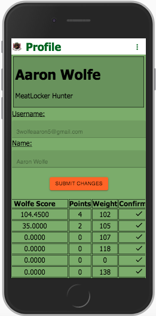
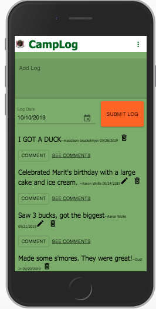

# MeetLocker

## Description

_Duration: 2 Week Sprint_

The Meetlocker app is a mobile friendly react.js app that allows cabin-goers to keep track of event dates, experiences, and bagged animals for their cabin.  Hunters can create and delete their own events, post logs and comments to the camp log page as well as see what other users have posted, and submit recent trophies for evaluation by the cabin admin. 

To see the fully functional site, please visit: [MeetLocker](https://still-tundra-03699.herokuapp.com)

## Screen Shot

### Profile Page

### Camp Log

### Prerequisites

- [Node.js](https://nodejs.org/en/)

## Installation

1. Create a database named `meetlocker`,
2. The queries in the `database.sql` file are set up to create all the necessary tables and populate the needed data to allow the application to run correctly. The project is built on [Postgres](https://www.postgresql.org/download/), so you will need to make sure to have that installed. We recommend using Postico to run those queries as that was used to create the queries, 
3. Create a .env file in the main folder with and set 'SERVER_SESSION_SECRET' to a randomly generated password
4. Open up your editor of choice and run an `npm install`
5. Run `npm run server` in your terminal
6. Run `npm run client` in your terminal
7. The `npm run client` command will open up a new browser tab for you!

## Usage

1. Login or Register to gain access to the app.
2. Upon successful login or registration you'll be notified that the admin needs to approve you before you gain access to the application.
3. You can contact the Admin (myself) to see if you have been approved or not, or simply try to log in and see if you are directed to a calendar page.
4. Upon approval you will be able to access the app and the first page you will see is the calendar of upcoming events.
5. The nav bar at the top has a drop down menu where you can visit the leaderboard to set current standings and submit a bagged animal, check out the camp log to post your experiences at the Meetlocker, or go to your profile page to checkout your personal information and view past trophies.

## Built With

React, Redux, Saga, Sweetalert, Material-UI, Express, Passport, and PostgreSQL. (a full list of dependencies can be found in `package.json`).

## License
[MIT](https://choosealicense.com/licenses/mit/)

## Acknowledgement
Thanks to [Prime Digital Academy](www.primeacademy.io) in Minneapolis who equipped and helped me to make this application a reality.

## Contact

Aaron Wolfe - If you have suggestions or issues, please email me at 3wolfeaaron5@gmail.com

Project Link: (https://github.com/Wherewolfe35/meetlocker-app)(https://still-tundra-03699.herokuapp.com)

